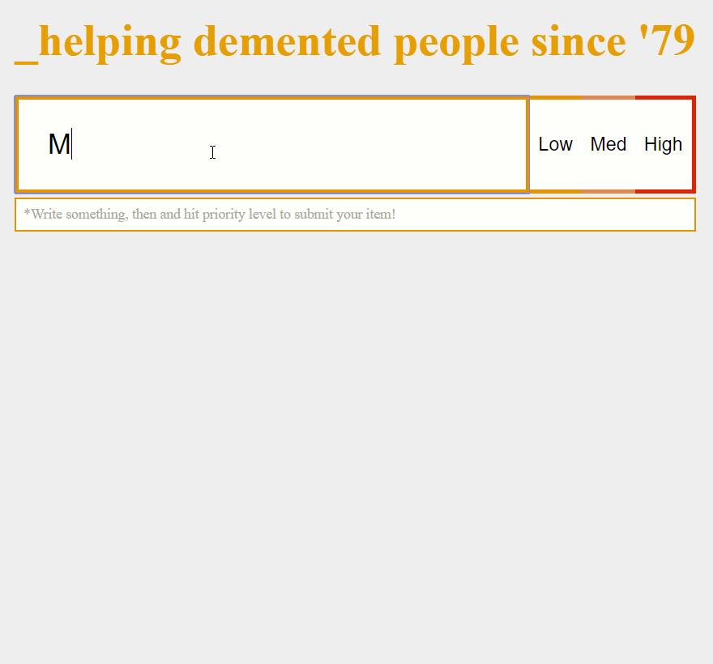

# Simple ToDo w/ React Webpack Setup (No CRA)

## How To Get Rollin'

- git clone desired folder
- npm i
- npm start
- Prepare to get bored!

## What's included:

- todos are saved to localstorage
- priority system: high priority items are sorted to top of the list
- items are colored by priority
- item deletion

## Next

- Add TypeScript
